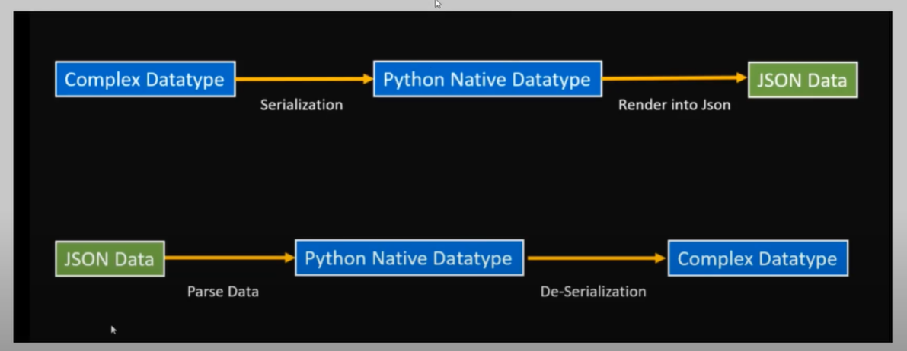

<details>
<summary><h3 style="color: blue;">REST API</h3></summary>
 
 REST API is  Representational State Transfer Application Programming Interface

 # REST API Have 4 points
  - End point ( last point from the base ulr where an API or service can be accessed)
  - Method ( POST, PUT/PATCH, GET, DELETE)
    
     - POST : POST for creating data --- C
     - PUT : PUT for updating data  --- U
     - GET : GET for retrieving data  --- R
     - DELETE : DELETE for deleting data --- D
       
     <p>Together these four operations make up the basic operations of storage management known as CRUD</p>   
  - Headers
        <p>headers provide additional information about the request or the response.</p>
        
     - Status Code:
        | Status      | Description     |
        | :--------   | :---------------|
        | 200         | ok              |
        | 404         | Page not Found  |
        | 505         | Server Error    |

          
    
    
  - Data
     <p>Which Data we wil send frontend to BackEnd</p>
  

</details>

<details>
<summary><h3 style="color: blue;">Installation & Essential Stuff </h3></summary>

  
## Run 

 - Install Django  REST Framework

```bash
pip install djangorestframework
```
 - Markdown support for the browsable API.
   
```bash
pip install markdown       
```
 - Filtering support
   
```bash
pip install django-filter  
```


 - Go to Settings.py and register the app

```bash
 INSTALLED_APPS = [
    ...
    'rest_framework',
]
```
- Then Create A App 

```bash
django-admin startapp Myapp
```

- register the app
    - It is mandatory to register the app after create App every time 

```bash
 INSTALLED_APPS = [
    ...
    'Myapp',
]
```

- Then Create A Model
  
```bash
from django.db import models

class Service(models.Model):
    name = models.CharField(max_length =30)
    description =models.TextField()
    image = models.ImageField(upload_to='service/images/') 

    def __str__(self) -> str:
        return self.name
```
After Creating a Model Every time we have  makemigrations and migrate and register it in Admin panel  

</details>
<details>
<summary><h3 style="color: blue;">Serializers</h3></summary>

 - Model Data ------Serialization---> JSON
     - JSON -> JavaScript Object Notation
<p>Serializers are used to convert complex data types, such as Django model instances, into Python data types that can be easily rendered into JSON, XML, or other content types.</p>





 ### Model Serializer
 
   - we can work with multiple method (GET,POST,PUT/PATCH,DELETE) via ModelSerializer
       - PUT : We can update whole model via put method
       - PATCH : Slide change .

```bash
from rest_framework import serializers
from . import models 

class AppointmentSerializer(serializers.ModelSerializer):
#    patient = serializers.StringRelatedField(many=False)
   class Meta:
        model = models.Appointment
        fields = '__all__'
```

#### Views for ModelViewSet

```bash
from django.shortcuts import render
from . import models , serializers
from rest_framework import viewsets

class AppointmentViewSet(viewsets.ModelViewSet):
    queryset = models.Appointment.objects.all()
    serializer_class = serializers.AppointmentSerializer
```

# Custom Query set in Views.py
```bash
from django.shortcuts import render
from . import models , serializers
from rest_framework import viewsets

class AppointmentViewSet(viewsets.ModelViewSet):
    queryset = models.Appointment.objects.all()
    serializer_class = serializers.AppointmentSerializer

    def get_queryset(self):
        queryset = super().get_queryset() # Sob gula query nilam 6 no line thake 
        patient_id = self.request.query_params.get("patient_id")

        if patient_id:
            queryset = queryset.filter(patient_id=patient_id)
        return queryset
    
    def get_queryset(self):
        queryset = super().get_queryset() # Sob gula query nilam 6 no line thake 
        doctor_id = self.request.query_params.get("doctor_id")

        if doctor_id:
            queryset = queryset.filter(doctor_id=doctor_id)
        return queryset
```

</details>


